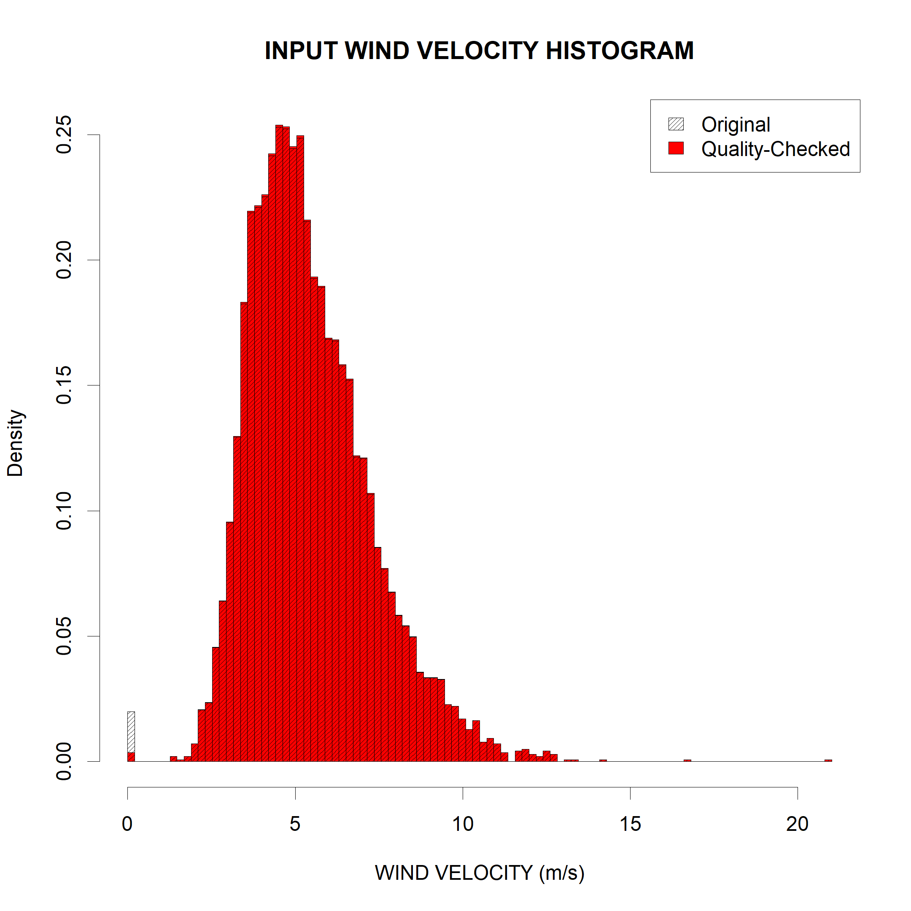
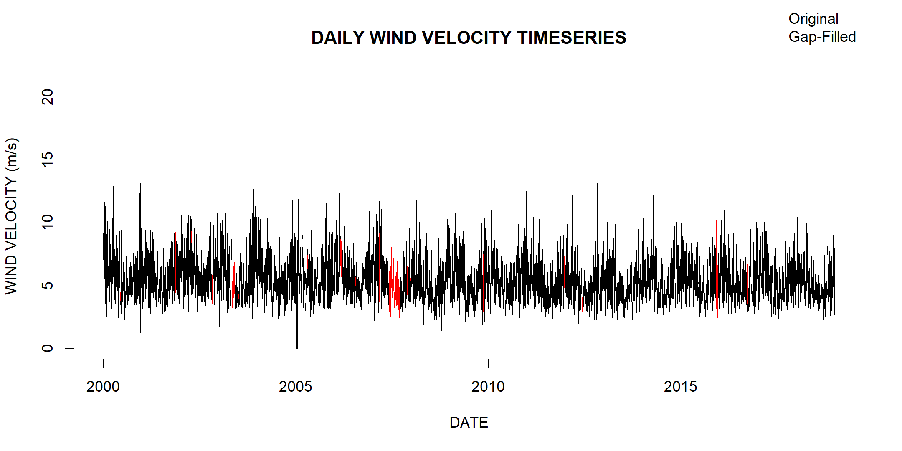

# Summary

A key driver of erosion, and arguably the most labor-intensive input to erosion models, especially the Water Erosion Prediction Project (WEPP) model [@USDA:1995], is climate. Even the simplest erosion models require climate inputs which are not always straightforward in their calculation. The complexity of these inputs dissuades potential users from creating their own inputs from observed data, which are almost always better than their simulated counterparts, especially when used to force erosion models for historical periods. For example, the Revised Universal Soil Loss Equation version 2 (RUSLE2) [@USDA:2013] and WEPP are two of the leading soil erosion prediction models in the world today, but both still rely on climate inputs that are generated from outdated data, tools, or both.

It appears that the lack of sufficient software in this field has resulted in models being used with suboptimal climate data inputs, which can, if left unaddressed, stifle scientific discovery and advancement. RUSLE2, as currently applied commonly within the United States, relies on climate data from 1960-1999. This data is not only 20 years out of date, but the years utilized had fewer observation stations and the stations themselves used a mix of older technologies, some of which have documented quality issues that impact usability and reliability [@Hollinger:2002; @USDA:2013; @McGehee:2018]. WEPP on the other hand, just had its climate database updated to the years 1974-2013 [@Srivastava:2019], but those observed values are only used to create parameter files for CLImate GENerator (CLIGEN) [@Nicks:1995] which is then used to create simulated climate files for WEPP. Some internal investigations at the National Soil Erosion Research Laboratory (NSERL) have identified the climate inputs to both models as a significant reason for differences in their predictions of soil loss under otherwise identical simulations.

In short, the erosion modeling community is in need of software that can at least shoulder most of the burden when preparing climate inputs for soil loss models. Therefore, we are proposing a WEPP CLImate File Formatter (WEPPCLIFF) program to begin addressing this need.

``WEPPCLIFF`` is an R-based command line tool which was originally designed to prepare 'breakpoint format' climate file inputs for WEPP (Figure 1) that has been extended to perform other general functions such as quality checking (Figures 2 and 3), gap filling (Figure 4), and erosion index calculations (climate inputs for the USLE family of models). The program is also provided with extensive accompanying documentation which covers a range of topics including most notably: installation, syntax, input, output, and examples.

# Existing Software

The only related software of which we are aware is a publicly distributed executable program called Rainfall Instensity Summarization Tool (RIST) [@USDA:2019]. RIST is currently maintained by the USDA ARS National Sedimentation Laboratory (NSL) where it can be used as a tool to prepare climate inputs for RUSLE, WEPP, SWAT, and AnnAGNPS. However, the WEPP inputs for example, are only provided in the 'tp-ip' file format rather than the 'breakpoint' file format which means that only the intensity-at-peak factor, time-to-peak factor, and daily precipitation amount and duration are actually provided to WEPP to fit a double exponential storm distribution and finally generate breakpoints for erosion calculations. Therefore, much of the observed data is being discarded when providing 'observed climate inputs' to WEPP using RIST. WEPPCLIFF, on the other hand, maintains the original precipitation breakpoints in its climate file output thereby providing more valuable climate inputs to WEPP.

# Validation

WEPPCLIFF was developed from and validated by comparing to several different works including: three Agriculture Handbooks (AH282 [@Wischmeier:1965], AH537 [@Wischmeier:1978], and AH703 [@Renard:1997]), two peer-reviewed articles [@McGehee:2018; @McGregor:1995], and RIST [@USDA:2019]. The comparison with RIST is of particular interest since this was completed as part of a massive WEPP-RUSLE2 model comparison project between the NSERL and NSL ARS laboratories. This project resulted in several important findings related to climate representations in both models (WEPP and RUSLE2), their accompanying input generation softwares (CLIGEN, RIST, and now WEPPCLIFF), and the impacts on erosion predictions. An example comparison related to WEPPCLIFF found that RIST (April 2019 release version) erroneously calculated kinetic energy and RUSLE2 erosion indices to be 26% and 21% too low, respectively. RIST was updated with more correct calculations in May 2019 (there are still differences of about 3% for the stations compared), but RIST has been actively used since 2006 with several scientific works, and this error may have impacted several or all of those works. More comprehensive summaries of findings from this comparison project are expected to be published in scientific literature in the near future.

# References